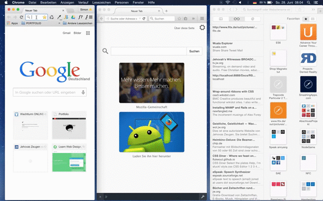

##Realtime Chat with Node.js
---  
  

NodeJs Mongodb Socket.io Realtime chat  

### Setup 
 Install <a href="https://nodejs.org/en/" alt="nodejs">Node js</a>  
  Read <a href="https://nodejs.org/en/docs/ ">docs</a>  
 
 
 Install mongodb <a href="https://www.mongodb.org/">mongodb</a>  
 Read <a href="http://docs.mongodb.org/manual/installation/">docs</a>  
 
 #### Start mongod:
 
    $ mongod    
       
    
 #### Start app:  

     $ cd [path to]/responsive_nodejs_chat/
     
     $ npm install
       
     $ node server.js  
     
_Open your favourite browser at localhost:3000_   
 
 
### DEMO    

"Room chat example" - [Go
here!](https://github.com/SimHub/node_chat_room)
 
---  
#### Desktop  
 
   
 
#### Web App 
 
 

 

     
     
